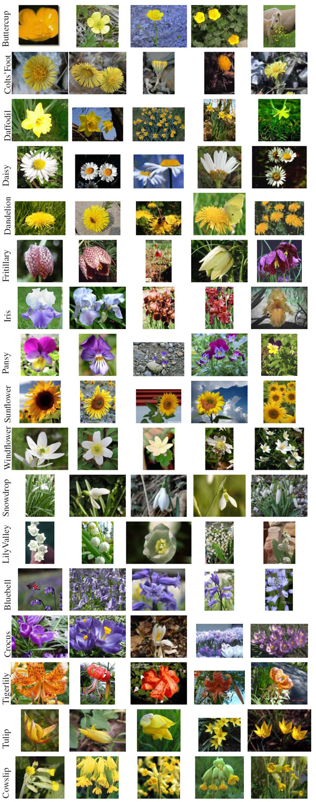

# Flowers classification
## Background
In this project, I aimed to develop a deep neural network to classify images of flowers into one of 17 categories from [the 17 Category Flower Dataset](https://www.robots.ox.ac.uk/~vgg/data/flowers/17/). The dataset contains 17 categories of flowers, each with 80 images (for a total of 1,360 images). Examples of flower images in each category are shown in Figure 1.

*Figure 1. Examples of flowers in each category.*

## Model
To address this problem, I used the pre-trained convolutional neural network [EfficientNet-B0](https://arxiv.org/abs/1905.11946). I rescaled and normalized the images using the data transformations that were originally applied when training the model on [the ImageNet dataset](https://www.image-net.org/). To reduce the risk of overfitting, I augmented the data and implemented early stopping.

## Results

After 52 epochs, the early stopping condition was triggered. The best model achieved an accuracy of 96.69% on the validation set and 94.81% on the test set. The accuracy and loss values for the training and validation sets across each epoch of training are presented in Figure 2.

*Figure 2. The values of accuracy and loss for training and validation sets in consecutive epochs.*
